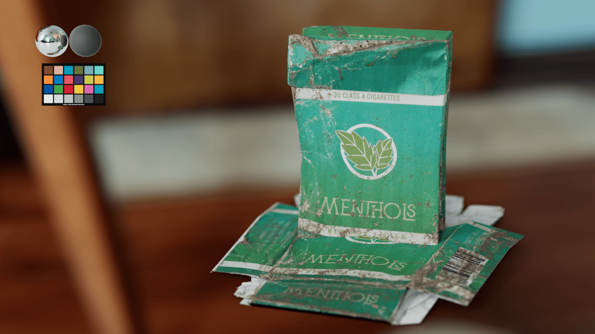

# Blender Mixer

---

This is an almost 1:1 fork of **Quixel's official Megascan Live Link** for Blender 2.80+

The initial reason was to support ACES when detected:
- **sRGB** -> Utility - sRGB - Texture
- **Linear** -> Utility - Linear - sRGB
- **Non-Color** -> Utility - Raw

### Planned Features

- [ ] Add LuxCore Support (it already works thanks to LuxCore translation, but I want to add a dedicated LuxCore hook )